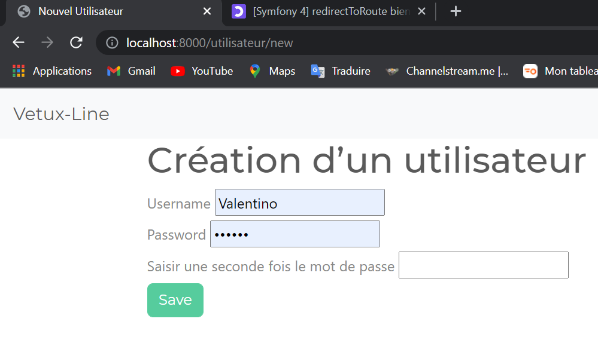
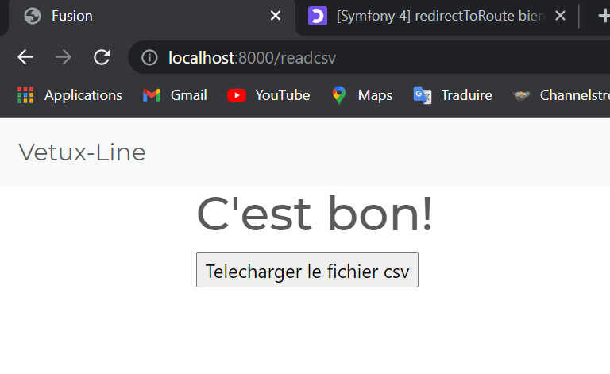

<h1>Vetux Line</h1> Niveau : Deuxième année de BTS SIO SLAM

<h1>Projet</h1> Dans ce projet nous travaillons pour l’entreprise Vetux-Line qui est une entreprise de création de vêtementsVetux-Liune reçois tous les deux mois 2 fichiers client Csv .Ce projet a pour but de crée une application pour l’entreprise qui va nous permettre de fusionner deux fichiers CSV en un seul .Pour effectuer ceci notre entreprise nous transmet deux fichiers Csv qui se nomment: french-client.csv (avec 3000 clients) et un german-client.csv ( avec 2000 clients)

<h1>Premiere Partie </h1> Pour cette mission nous avons pour but de :

Cree un un formulaire d’authentification

Upload les deux fichiers csv

Filtrer les données renvoyer ( genre, titre, nom, prénom, email, date de naissance, num tel, CCType, CCNumber, CVV2, CCExpires, adresse physique (plusieurs colonnes), taille, poids, véhicule, coordonnées GPS. )

Fusionner les deux fichiers Csv

Une fois les deux fichier fusionner le download

Pour cette Partie 1 nous avons reduit le volume des deux fichiers csv est ont n’a modifier leur nom, small-french-client.csv (12 clients) et small-german-client.csv (8 clients)

<h1>Premiere tache effectuer : Login Registre</h1>

Nous avons créé un formulaire d’authentification qui nous a permis de nous inscrire et de nous connecter en tant qu’admin ou en tant que simple membre ou bien de nous déconnecter, l’Admin après s’etre connecter va pouvoir uploader deux fichiers Csv. Tandis que un utilisateur va pouvoir modifier son compte c’est-à-dire modifier son mot de passe ou son nom d’utilisateur ou supprimer son compte. <h1>Deuxième Tache </h1>

Pour commencer cette partie nous avons decider de crée un formulaire pour upload pour cela dans le service Y aml nous avons défini un paramètre qui contient le nom du répertoire où les images doivent être téléchargées ; upload_dir: '../public/uploads'

nous avons rajouter : bind: $uploadDir: '%upload_dir%' dans le service.yaml aussi juste en dessous de autowire: true # Automatically injects dependencies in your services. autoconfigure: true # Automatically registers your services as commands, …​

Nous avons par la suite cree une controleur avec la commande : php bin/console make:controller HomeController

Ce formulaire va permettre d’envoyer une vue contenant le formulaire Web à l’utilisateur.

Nous avons ensuite cree un controleur qui repond a la soumission du formulaire avec la commande : php bin/console make:controller UploadController

$token = $request→get("token");

if (!$this→isCsrfTokenValid('upload', $token)) { $logger→info("CSRF failure");

    return new Response("Operation not allowed",  Response::HTTP_BAD_REQUEST,
        ['content-type' => 'text/plain']);
}
Nous récupérons le jeton et le validons avec la méthode. Si la validation échoue, nous enregistrons l’incident et envoyons une réponse simple « Opération non autorisée » et un code de réponse. isCsrfTokenValid()Response::HTTP_BAD_REQUEST
$file = $request→files→get('myfile');

if (empty($file)) { return new Response("No file specified", Response::HTTP_UNPROCESSABLE_ENTITY, ['content-type' ⇒ 'text/plain']); } Nous vérifions si l’utilisateur a spécifié un fichier dans le formulaire avec la méthode. Si le champ de saisie est vide, nous renvoyons un texte brut « Aucun fichier spécifié » au client avec le code de réponse. empty()Response::HTTP_UNPROCESSABLE_ENTITY

$filename = $file→getClientOriginalName(); (ligne de code)

Nous obtenons le nom du fichier avec . GetClientOriginalName()

$uploader→upload($uploadDir, $file, $filename); (ligne de code )

Nous appelons la méthode de service de téléchargement, qui déplace le fichier vers le répertoire choisi. Nous passons à la méthode le nom du répertoire, les données du fichier et le nom du fichier. upload()

et nous finisson par un return : return new Response("File uploaded", Response::HTTP_OK, ['content-type' ⇒ 'text/plain']); suite a ca nous avons crée un dossier dans src nomme Service puis dans ce dossier nous avons cree FileUploader.php

ce service va permettre deplacer,les fichiers vers le répertoire de téléchargement.

<h1>Troisieme tache </h1>

Les deux fichier uploader on tetait fusionner et trier le trie a etait effectuer grace a cette ligne qui nous a permis de selectionner certaine categhorie : $tabName = ["Number", "GivenName", "Surname", "Birthday", "StreetAddress", 'NameSet', "EmailAddress", "TelephoneNumber", "Kilograms", "CCType", "CCNumber", "CVV2", "CCExpires", "Vehicle"];

<h1>Quatrieme tache </h1>

$response = new BinaryFileResponse('../public/csv/output.csv');

cette ligne qui va permettre de dire ou le fichier va etre telecharger

$response = new BinaryFileResponse('../public/csv/output.csv'); $response→headers→set('Content-Type', 'text/csv'); $response→setContentDisposition( ResponseHeaderBag::DISPOSITION_ATTACHMENT, 'fusion.csv' ); return $response;

ce code va nous permttre de telechager le nouveau fichier fusionner

<h2>Problème rencontré</h2> Dans cette partie notre principal problème a été la fusion difficile de trouver des aides sur internet on n’a donc reçu l’aide de nos camarades de classe pour effectuer cette fusion

<h1>Deuxieme Partie:ETL</h1>
Nous devions mettre les données des clients, les véhicules en particulier, dans une base de données.

Pour effectuer cette partie nous avons utiliser la methode du ManyToOne et OneToMany

On récupère le fichier fusionné directement dans le serveur, puis on récupère les parties qui sont intéressante (marque , nom des clients,  voiture ect...)  pour le rentre dans la base de données.

<h1>Problème rencontré </h1> Pour cette partie nous n'avons pas pu faire une représentation graphique de données statistiques  ainsi que le Evil User Stories.

<h1>Conclusion </h1>

Ce projet était intéressant il nous a permis de développer certain acquis et malgres que nous avons pas pue réussir jusqu’à la fin il nous a permit de nous familiariser avec le framework symfony